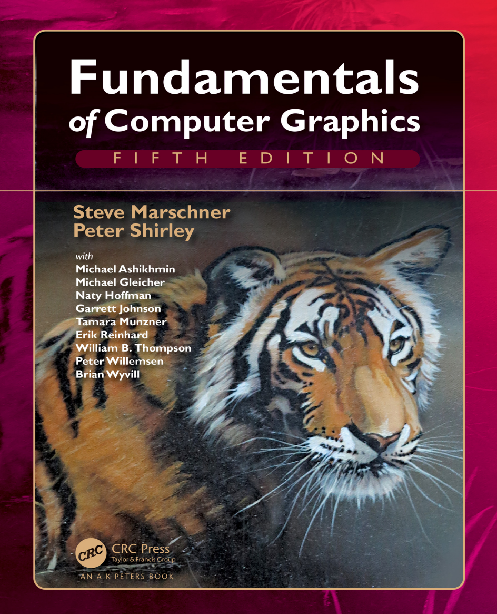

# 《计算机图形基础》第五版个人翻译

**本仓库仅用于学习交流使用，切勿盗取，抄袭商用等**
****
**全文翻译为个人学习翻译过程中的留档，无校对，如有错误有请谅解，可以在issue提出或者提交pr进行更改**

翻译者寄语：当你查到这个仓库的时候，相信你是一位跟我一样想要开始学习计算机图形相关的新人，虎书是一个很不错的选择。不过这条道路也是困难的，除了计算机图形也要学习好线性代数，希望能坚持下去，加油！！！

## 目录

1. [介绍](./book/first_Introduction.md#1)  
    1.1 [图形领域]()  
    1.2 [主要应用](")  
    1.3 [图形API]()  
    1.4 [图形管线]()  
    1.5 [数值问题]()  
    1.6 [效能]()  
    1.7 [设计和编码图形程序]()  
2. 

